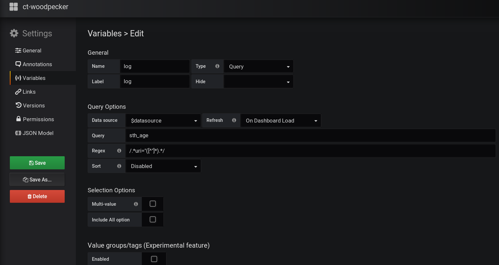

# Overview
The function of `ct-woodpecker` is primarily based around exposing [Prometheus](https://github.com/prometheus/prometheus) stats and does not handle the monitoring/alerting of those stats itself. For the purpose of monitoring/alerting you can use [Grafana](https://github.com/grafana/grafana) and [Alertmanager](https://github.com/prometheus/alertmanager).

These files are updated on a best-effort basis.

- - - -
# Grafana

Tested with Grafana v5.X.

The `datasource` variable referenced in `dashboard.json` can be configured in grafana after importing `dashboard.json` per the following images.

- - - -
# Prometheus and Alertmanager

Tested with Prometheus v2 and Alertmanager v0.16.
